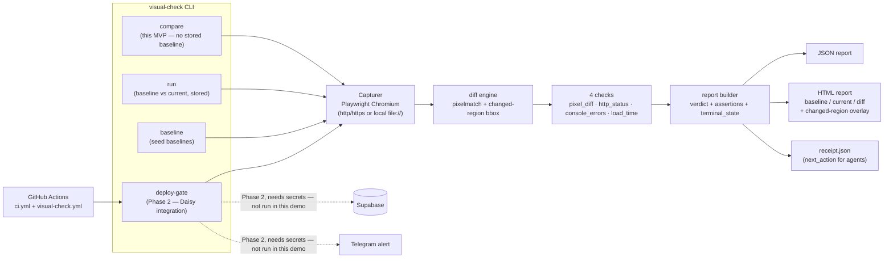

# Visual Check — Hackathon Demo

## The problem (30 seconds)

Agents (and CI pipelines) say "done" the moment code compiles and unit tests
pass — but nobody actually looked at the rendered page. Layouts shift, colors
invert, buttons vanish behind an overflow bug, and the first person to notice
is a user, not a test. Visual Check closes that gap: it renders two pages
(a baseline and a current version) at real viewport sizes, diffs them
pixel-by-pixel, and returns a deterministic pass/fail verdict with visual
proof — no LLM call, no flaky heuristics, just Playwright + pixelmatch and
four checks that either pass or don't.

## What's new in this MVP

A single credential-free command, `visual-check compare`, that takes two
targets — URLs **or local files** — and does the whole job in one shot: no
pre-seeded baseline store, no cloud service, no API keys. It reuses every
existing building block (the Playwright capturer, the 4 checks, the JSON
verdict schema, the HTML report renderer) and adds one new evidence layer:
a **changed-region bounding box**, drawn as an overlay on the current and
diff screenshots, so a reviewer sees exactly *where* the regression is, not
just *that* one exists.

## Live demo — exact 60-second sequence

```bash
git clone https://github.com/TombStoneDash/visual-check.git
cd visual-check
npm install            # also runs `playwright install chromium`
npm run build          # compiles src/ -> dist/cli.js

npm run demo:smoke     # runs both scenarios below and verifies them
```

`demo:smoke` runs two `compare` invocations against the fixtures in
`demo/fixtures/` (no network, no credentials) and checks both the exit code
and the report contents:

```bash
# Scenario 1 — identical pages: pass, exit 0
node dist/cli.js compare \
  --baseline demo/fixtures/page.html \
  --current  demo/fixtures/page.html \
  --viewports mobile,desktop --threshold 5 \
  --out demo/output/pass --json demo/output/pass/report.json

# Scenario 2 — intentional visual regression: fail, exit 1
node dist/cli.js compare \
  --baseline demo/fixtures/page.html \
  --current  demo/fixtures/page-changed.html \
  --viewports mobile,desktop --threshold 5 \
  --out demo/output/fail --json demo/output/fail/report.json
```

Then open the reports left behind for inspection:

```bash
# Windows
start demo/output/fail/report.html
start demo/output/pass/report.html

# macOS/Linux
open demo/output/fail/report.html
```

`demo/output/fail/report.html` shows the FAIL verdict, the baseline vs.
current vs. diff triptych, a magenta changed-region box over the recolored
hero section, and the 5% threshold that was exceeded. `demo/output/pass/`
shows the same layout with a clean PASS and no changed region.

## Architecture



## Current vs. roadmap — the factual line

| | Status |
|---|---|
| CLI commands: `baseline`, `run`, `compare` (new), `deploy-gate`, `promote` | ✅ Shipped, in this repo |
| 4 deterministic checks (pixel diff, HTTP status, console errors, load time) | ✅ Shipped, reused unchanged |
| 3 fixed viewports (mobile 390×844, tablet 768×1024, desktop 1440×900) | ✅ Shipped, reused unchanged |
| JSON verdict schema (`pass/fail/warn/error/needs_baseline` + assertions + terminal state) | ✅ Shipped, reused unchanged |
| Standalone HTML report (data-URI screenshots, diff image) | ✅ Shipped |
| Changed-region bounding-box evidence overlay | ✅ New in this MVP |
| Credential-free `compare` (URL-vs-URL or local-page-vs-local-page, no stored baseline) | ✅ New in this MVP |
| GitHub Actions: `ci.yml` (typecheck/test/build) + `visual-check.yml` (manual deploy-gate dispatch) | ✅ Shipped |
| Supabase artifact storage, Postgres run history, Telegram alerts, baseline promotion | ⏳ Phase 2 — code exists in `src/storage.ts`/`src/db.ts`/`src/alerts.ts`, requires secrets, **not exercised in this credential-free demo** |
| Hosted dashboard, public API, MCP server, metered billing | ⏳ Phase 3 (`noui.bot`) — not built |
| VLM fallback for ambiguous diffs, video capture, live feedback | ⏳ Phase 4 — not built |

## Judging pitch

- **Deterministic first.** No LLM in the verdict path — pixelmatch + 4 checks
  either pass or fail the same way every time. Zero inference cost.
- **Zero setup for the core loop.** `compare` needs no stored baseline, no
  API key, no cloud account — clone, build, point it at two pages, get a
  verdict and visual proof.
- **Agent-native output.** The JSON report and receipt are built for a
  worker to read and act on (`next_action`, `terminal_state`), not just for
  a human to eyeball.
- **Evidence, not just a number.** The changed-region overlay turns
  "12.5% diff" into "here, exactly, is what changed" — a report a
  non-technical reviewer can triage in 15 seconds.
- **We extended, we didn't rebuild.** Every check, viewport, JSON field, and
  HTML section a reviewer sees today already existed in the repo; this MVP
  adds one new command and one new evidence field on top of the same
  pipeline used by `run` and `deploy-gate`.
